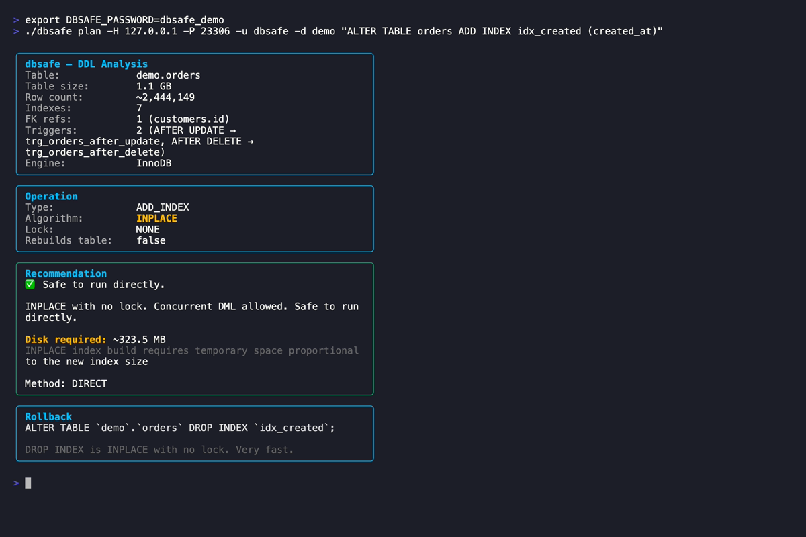
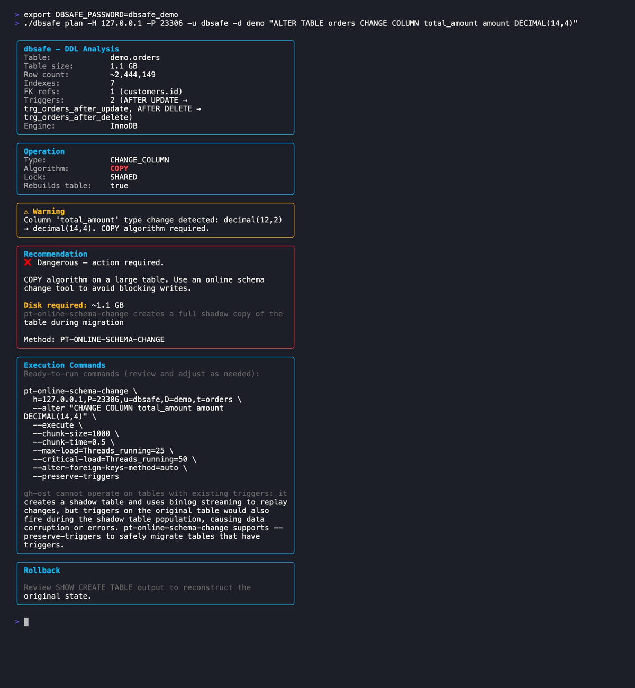
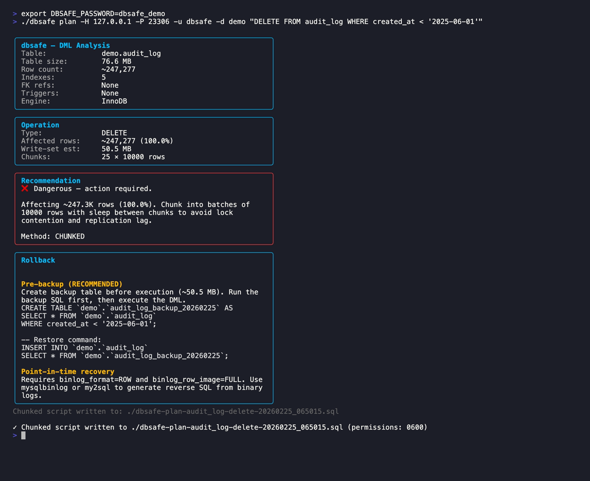
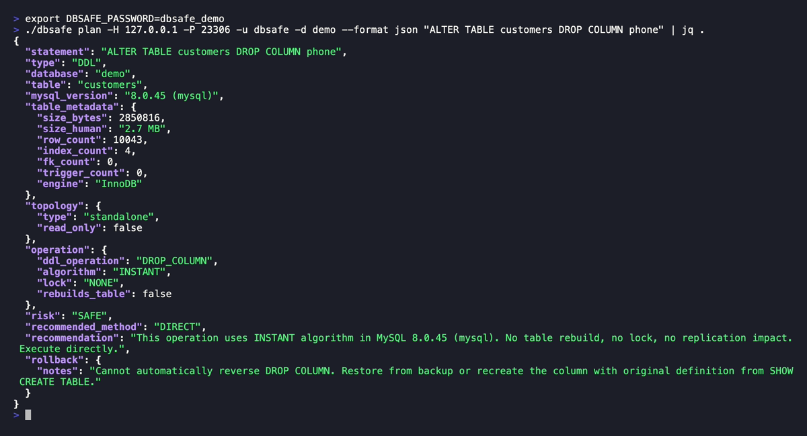
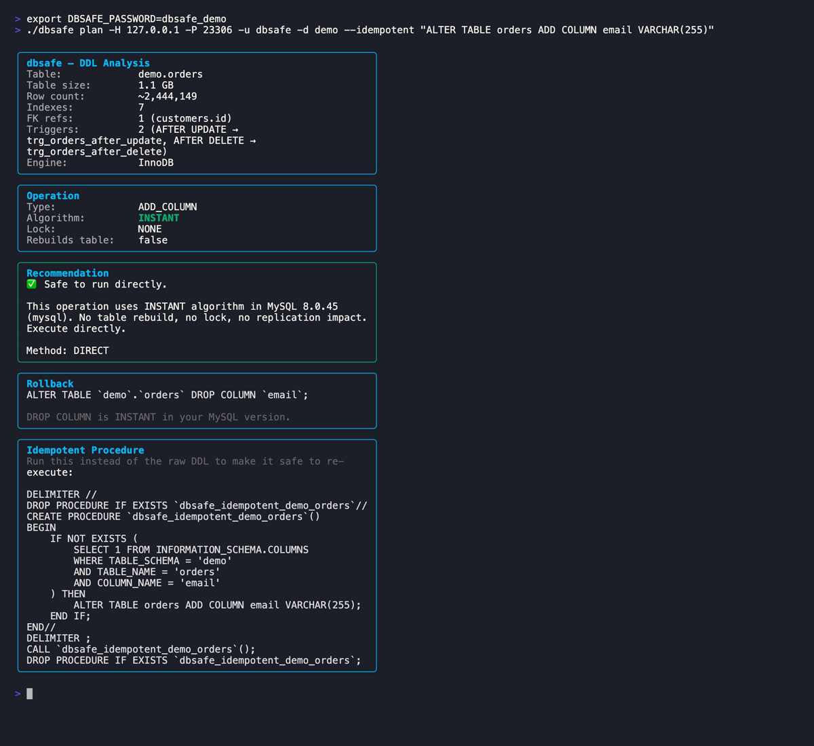

<h1 align="center">
	<br>
	
	<br>
</h1>

<h4 align="center">🛡️ Know exactly what your MySQL DDL/DML will do <em>before</em> you run it</h4>

<p align="center">
	<a href="https://github.com/nethalo/dbsafe/releases"></a>
	<a href="https://github.com/nethalo/dbsafe/releases"></a>
	<a href="https://github.com/nethalo/dbsafe/blob/main/LICENSE"></a>
</p>

> **No more surprises.** Pre-execution safety analysis for MySQL DDL/DML operations.

---

## ✨ Highlights

- 🔍 **Algorithm detection** — INSTANT / INPLACE / COPY, per MySQL version
- 🎯 **Risk classification** — Safe, Caution, or Dangerous
- 🌐 **Topology aware** — Galera/PXC, Group Replication, async replicas, Aurora, RDS
- ☁️ **AWS MySQL ready** — Aurora MySQL, Amazon RDS (TLS support)
- 📊 **Impact estimation** — table size, row count, replication lag
- 📝 **Chunked scripts** — auto-generated batched DELETE/UPDATE for large operations
- 🔁 **Idempotent wrappers** — `--idempotent` generates a stored procedure with `IF NOT EXISTS` guards, safe to re-run
- 🎨 **Multiple formats** — text, plain, JSON, Markdown (great for CI/CD)
- ⚡ **Read-only** — never modifies your data

---

## 📦 Installation

```bash
curl -sSfL https://raw.githubusercontent.com/nethalo/dbsafe/main/install.sh | sh -s -- -b /usr/local/bin
```

Or build from source (requires Go 1.23+):

```bash
git clone https://github.com/nethalo/dbsafe.git && cd dbsafe && make build
```

---

## 🚀 Quick Start

```sql
-- 1. Create a read-only MySQL user
CREATE USER 'dbsafe'@'%' IDENTIFIED BY '<password>';
GRANT SELECT, PROCESS, REPLICATION CLIENT ON *.* TO 'dbsafe'@'%';
```

```bash
# 2. Configure
dbsafe config init

# 3. Analyze
dbsafe plan "ALTER TABLE users ADD COLUMN email VARCHAR(255)"
```

---

## 💡 Examples

**DDL analysis** — INPLACE on a 1.2 GB table, recommends gh-ost or pt-osc:

```bash
dbsafe plan "ALTER TABLE orders ADD INDEX idx_created (created_at)"
```



---

**CHANGE COLUMN** — detects rename-only (INPLACE) vs type change (COPY) using live schema:

```bash
dbsafe plan "ALTER TABLE orders CHANGE COLUMN total_amount amount DECIMAL(14,4)"
```



---

**DML with chunked script generation** — safe batched deletes for large tables:

```bash
dbsafe plan "DELETE FROM audit_log WHERE created_at < '2025-06-01'"
```



---

**JSON output** for CI/CD pipelines:

```bash
dbsafe plan --format json "ALTER TABLE customers DROP COLUMN phone" | jq .
```



---

**Idempotent wrapper** — safe to re-run; outputs a stored procedure with IF NOT EXISTS guard:

```bash
dbsafe plan --idempotent "ALTER TABLE orders ADD COLUMN email VARCHAR(255)"
```



---

**From a file:**

```bash
dbsafe plan --file migration.sql
```

---

## 🐬 Supported Versions

| Environment | Support |
|---|---|
| MySQL 8.0.x | ✅ |
| MySQL 8.4 LTS | ✅ |
| Aurora MySQL 3.x (8.0 compat) | ✅ |
| Amazon RDS MySQL 8.x | ✅ |
| Percona XtraDB Cluster 8.x | ✅ |
| Group Replication 8.x | ✅ |
| MySQL 5.7 / MariaDB | ❌ |

---

## ☁️ AWS RDS and Aurora MySQL

dbsafe supports Amazon RDS and Aurora MySQL. Both require TLS:

```bash
# Amazon RDS (TLS required)
dbsafe plan --host mydb.rds.amazonaws.com --tls=required \
  "ALTER TABLE orders ADD COLUMN archived_at DATETIME"

# Aurora MySQL (auto-detected; gh-ost is replaced with pt-osc automatically)
dbsafe plan --host cluster.cluster-xyz.us-east-1.rds.amazonaws.com \
  --tls=required "ALTER TABLE users ADD INDEX idx_email (email)"

# Custom CA certificate (e.g., self-signed or private CA)
dbsafe plan --host mydb.example.com --tls=custom --tls-ca=/path/to/ca.pem \
  "ALTER TABLE events DROP COLUMN legacy_col"
```

**TLS modes**: `disabled` · `preferred` · `required` · `skip-verify` · `custom`

**AWS tool compatibility**:

| Service | gh-ost | pt-osc |
|---|---|---|
| Amazon RDS | ✅ (needs `--allow-on-master --assume-rbr`) | ✅ |
| Aurora MySQL | ❌ (incompatible — storage-layer replication) | ✅ |

**Config file with TLS**:

```yaml
connections:
  default:
    host: mydb.rds.amazonaws.com
    port: 3306
    user: dbsafe
    database: myapp
    tls: required        # or: preferred, skip-verify, custom
    tls_ca: /path/ca.pem # only needed when tls: custom
```

**Aurora privileges** — `REPLICATION CLIENT` returns empty on Aurora; use `PROCESS` instead:

```sql
CREATE USER 'dbsafe'@'%' IDENTIFIED BY '<password>';
GRANT SELECT, PROCESS ON *.* TO 'dbsafe'@'%';
```

---

## ⚙️ Configuration

Location: `~/.dbsafe/config.yaml`

```yaml
connections:
  default:
    host: 127.0.0.1
    port: 3306
    user: dbsafe
    database: myapp

defaults:
  chunk_size: 10000
  format: text   # text | plain | json | markdown
```

```bash
dbsafe config init   # create interactively
dbsafe config show   # display current config
```

---

## 🧪 Testing

See [TESTING.md](TESTING.md) for the full guide. Quick reference:

```bash
go test ./...                          # unit tests (~2s)
./scripts/run-integration-tests.sh    # integration tests with real MySQL
go test -bench=. -benchmem ./internal/...  # benchmarks
```

Integration tests verified against MySQL 8.0 standalone and MySQL 8.4 LTS. See TESTING.md for Apple Silicon / ARM64 container notes.

---

## 🤝 Contributing

1. 🍴 Fork the repo
2. 🌿 Create a feature branch
3. ✅ Add tests
4. 🚀 Submit a PR

---

## 📄 License

Apache 2.0 — see [LICENSE](LICENSE).

---

<p align="center">
	<em>Made with ☕ and ❤️ for safer database operations</em>
	<br><br>
	<a href="https://github.com/nethalo/dbsafe">⭐ Star on GitHub</a> •
	<a href="https://github.com/nethalo/dbsafe/issues">🐛 Report Bug</a> •
	<a href="https://github.com/nethalo/dbsafe/issues">💡 Request Feature</a>
</p>
